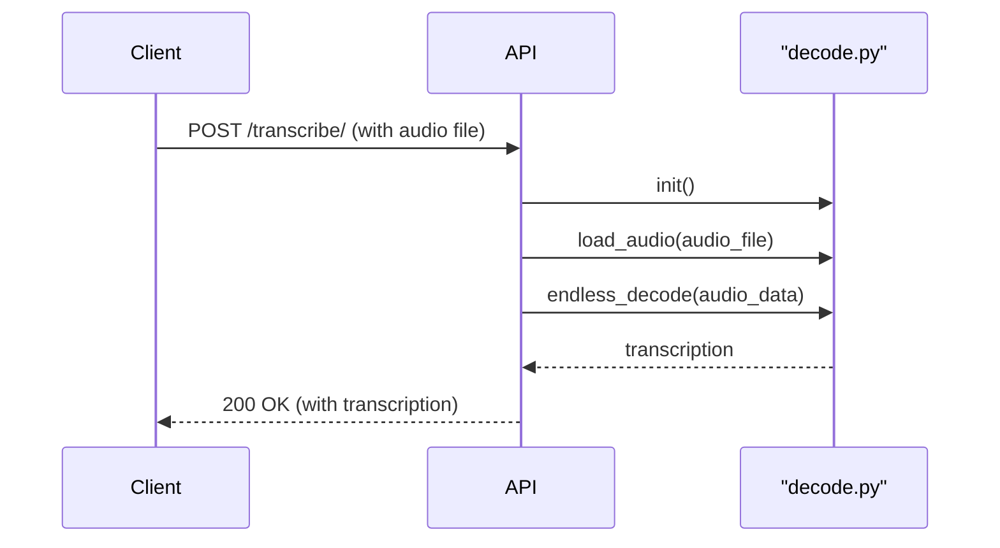
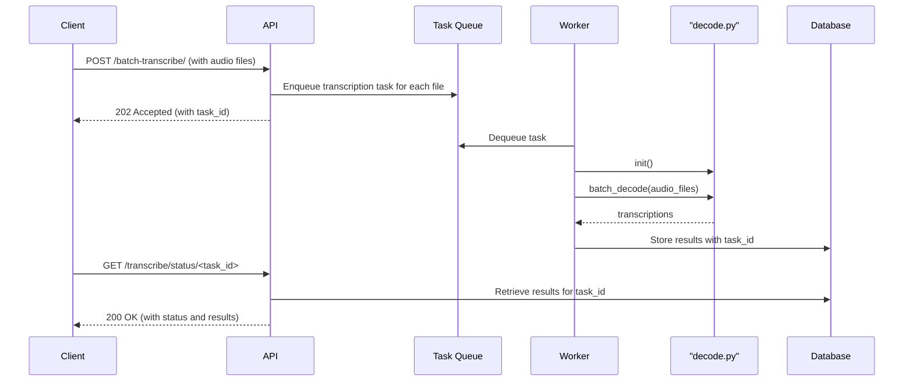

# API Design for chunkformer Transcription Service

This document outlines the API design for the chunkformer transcription service, which exposes the core transcription functionality of the application over a RESTful API.

## 2. API Endpoints

### 2.1. Single File Transcription

- **Endpoint:** `POST /transcribe/`
- **Description:** Transcribes a single audio file.
- **Request:**
  - **Headers:**
    - `Content-Type: multipart/form-data`
    - `X-API-Key: <your_api_key>`
  - **Body:**
    - `file`: The audio file to be transcribed.
- **Response:**
  - **Status Code:** `200 OK`
  - **Body:**
    ```json
    {
      "transcription": "The transcribed text of the audio file."
    }
    ```

### 2.2. Batch File Transcription

- **Endpoint:** `POST /batch-transcribe/`
- **Description:** Transcribes multiple audio files asynchronously.
- **Request:**
  - **Headers:**
    - `Content-Type: multipart/form-data`
    - `X-API-Key: <your_api_key>`
  - **Body:**
    - `files`: A list of audio files to be transcribed.
- **Response:**
  - **Status Code:** `202 Accepted`
  - **Body:**
    ```json
    {
      "task_id": "a_unique_task_id"
    }
    ```

### 2.3. Get Transcription Status

- **Endpoint:** `GET /transcribe/status/<task_id>`
- **Description:** Retrieves the status and results of a batch transcription task.
- **Request:**
  - **Headers:**
    - `X-API-Key: <your_api_key>`
- **Response:**
  - **Status Code:** `200 OK`
  - **Body:**
    ```json
    {
      "task_id": "a_unique_task_id",
      "status": "completed", // or "pending", "processing", "failed"
      "results": [
        {
          "filename": "test1.wav",
          "transcription": "The transcribed text of test1.wav."
        },
        {
          "filename": "test2.wav",
          "transcription": "The transcribed text of test2.wav."
        }
      ]
    }
    ```

## 3. Data Flow

### 3.1. Single File Transcription



### 3.2. Batch File Transcription



## 6. Configuration

Model checkpoint path

- The API service can be configured to load the ASR model from a custom checkpoint directory using the `MODEL_CHECKPOINT_PATH` environment variable.
- If not provided, the application will use its internal default path for model initialization during startup in [`api.py`](api.py:1).

Operational guidance

- The configured path should exist on the server and contain the expected model files produced by training or packaging.
- In containerized or orchestrated deployments, set `MODEL_CHECKPOINT_PATH` via environment configuration (e.g., Docker `-e`, Kubernetes `env`, or systemd `Environment=`).

Run examples

- Unix/macOS (bash/zsh):
  MODEL_CHECKPOINT_PATH="/absolute/or/relative/path/to/checkpoints" uvicorn api:app --reload

- Windows (PowerShell):
  $env:MODEL_CHECKPOINT_PATH="C:\path\to\checkpoints"; uvicorn api:app --reload

## 4. Asynchronous Processing

For the `/batch-transcribe` endpoint, a task queue (e.g., Celery with Redis or RabbitMQ) will be used to handle asynchronous processing.

1.  When a request is made to `/batch-transcribe`, the API will create a unique `task_id` and create a transcription task for each file in the request, adding them to the task queue.
2.  A pool of workers will be listening to the queue. When a worker picks up a task, it will call the `batch_decode` function from `decode.py` to transcribe the audio file.
3.  The transcription results will be stored in a database (e.g., Redis or a relational database) against the `task_id`.
4.  The client can poll the `/transcribe/status/<task_id>` endpoint to check the status of the task. Once the task is complete, the results will be returned.

## 5. Error Handling

A consistent error handling strategy will be implemented for the API.

| Status Code                 | Reason                     | Description                                               |
| --------------------------- | -------------------------- | --------------------------------------------------------- |
| `400 Bad Request`           | Invalid request format     | The request is malformed, e.g., missing a required field. |
| `401 Unauthorized`          | Invalid or missing API key | The API key is missing or invalid.                        |
| `404 Not Found`             | Task not found             | The requested `task_id` does not exist.                   |
| `500 Internal Server Error` | Server-side error          | An unexpected error occurred on the server.               |

**Error Response Body:**

```json
{
  "error": "A descriptive error message."
}
```
