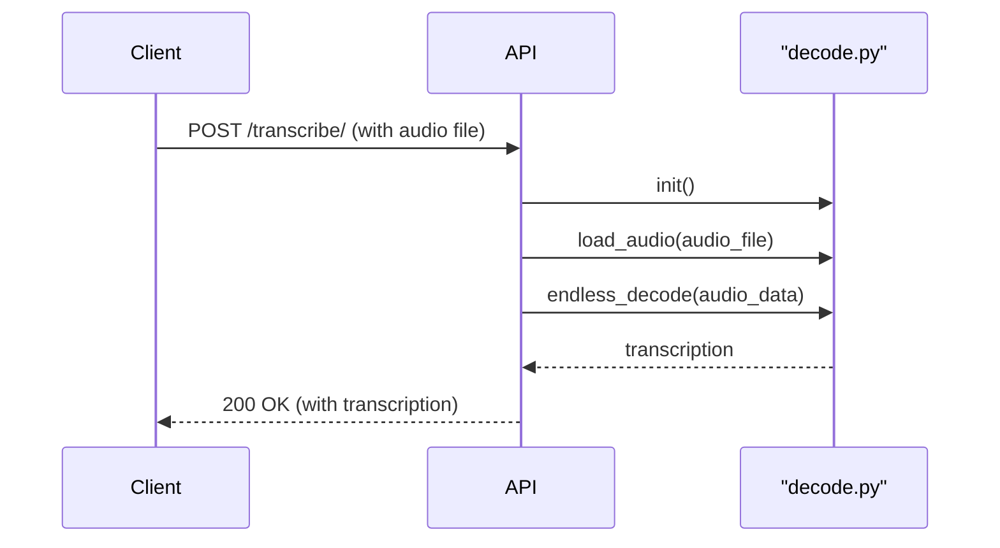
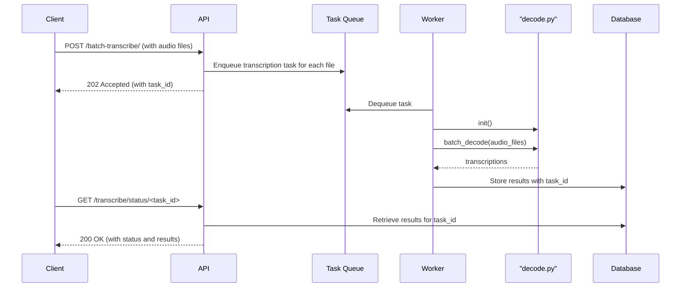

# API Design for chunkformer Transcription Service

This document outlines the API design for the chunkformer transcription service, which exposes the core transcription functionality of the application over a RESTful API.

## 2. API Endpoints

### 2.1. Single File Transcription

- **Endpoint:** `POST /transcribe/`
- **Description:** Transcribes a single audio file.
- **Request:**
  - **Headers:**
    - `Content-Type: multipart/form-data`
    - `X-API-Key: <your_api_key>`
  - **Body:**
    - `file`: The audio file to be transcribed.
- **Response:**
  - **Status Code:** `200 OK`
  - **Body:**
    ```json
    {
      "transcription": "The transcribed text of the audio file."
    }
    ```

### 2.2. Batch File Transcription

- **Endpoint:** `POST /batch-transcribe/`
- **Description:** Transcribes multiple audio files asynchronously.
- **Request:**
  - **Headers:**
    - `Content-Type: multipart/form-data`
    - `X-API-Key: <your_api_key>`
  - **Body:**
    - `files`: A list of audio files to be transcribed.
- **Response:**
  - **Status Code:** `202 Accepted`
  - **Body:**
    ```json
    {
      "task_id": "a_unique_task_id"
    }
    ```

### 2.3. Get Transcription Status

- **Endpoint:** `GET /transcribe/status/<task_id>`
- **Description:** Retrieves the status and results of a batch transcription task.
- **Request:**
  - **Headers:**
    - `X-API-Key: <your_api_key>`
- **Response:**
  - **Status Code:** `200 OK`\n - **API Response**\n - The standard success response includes a list of transcription segments for each file. Each segment is an object with:\n - `start` (number, seconds): The start time of the segment within the audio.\n - `end` (number, seconds): The end time of the segment within the audio.\n - `decode` (string): The decoded transcript text for the segment.\n - **Body:**\n `json\n    {\n      "task_id": "a_unique_task_id",\n      "status": "completed",\n      "results": [\n        {\n          "filename": "test1.wav",\n          "segments": [\n            { \"start\": 0.00, \"end\": 2.35, \"decode\": \"hello world\" },\n            { \"start\": 2.35, \"end\": 4.90, \"decode\": \"this is a test\" }\n          ]\n        },\n        {\n          "filename": "test2.wav",\n          "segments": [\n            { \"start\": 0.00, \"end\": 1.20, \"decode\": \"foo bar\" }\n          ]\n        }\n      ]\n    }\n    `

## 3. Data Flow

### 3.1. Single File Transcription



### 3.2. Batch File Transcription



## 6. Configuration

Centralized application configuration

- All application configuration is centralized in [`config.yml`](./config.yml:1). This YAML file defines the runtime parameters for API service, model behavior, caching, audio processing, and feature extraction. Centralization ensures a single source of truth across CLI, API, and batch workflows.

Loading and access pattern

- The configuration is loaded by the utility module [`model/utils/config.py`](./model/utils/config.py:1). That module exposes:
  - [`load_config()`](./model/utils/config.py:4): Reads the YAML file path (defaulting to `config.yml`) and returns a parsed Python dictionary.
  - A module-level [`config`](./model/utils/config.py:13) object initialized at import time to the result of [`load_config()`](./model/utils/config.py:4), making the configuration immediately available to any module that imports it.
- Recommended usage:
  - Import from the centralized utility rather than re-reading files:
    - from model.utils.config import config (Python.import():1)
  - For alternative configuration paths (e.g., testing or env-specific overrides), call:
    - config_dict = load_config("path/to/other-config.yml") (Python.call():1)

Configuration sections overview

- api
  - host: Bind address for the API service (e.g., 0.0.0.0 to accept external connections).
  - port: Listening port for the HTTP server.
- model
  - checkpoint: Identifier or path for the ASR model checkpoint to load.
  - chunk_size: Chunk length used during streaming/incremental decoding.
  - left_context_size / right_context_size: Context windows that influence model receptive field during inference.
  - total_batch_duration: Aggregate audio duration target for dynamic batching.
- cache
  - dir: Filesystem directory used to persist intermediate artifacts or model assets.
  - max_age_hours: Retention policy used to invalidate or refresh cache entries.
- audio
  - frame_rate: Target sample rate (Hz) to which audio should conform.
  - sample_width: Bytes per sample (e.g., 2 for 16-bit PCM).
  - channels: Number of audio channels expected (mono=1).
- features
  - num_mel_bins: Number of Mel filterbank channels to compute.
  - frame_length: Frame length in milliseconds for feature extraction windows.
  - frame_shift: Hop length in milliseconds between frames.
  - dither: Dithering value applied during feature computation.
  - energy_floor: Minimum energy floor to stabilize low-energy frames.
  - sample_frequency: Sample rate assumed by the feature extractor.

Operational guidance

- Default location: By default, the application reads `config.yml` from the project root. Ensure deployments mount or ship this file alongside the application binaries.
- Overrides: For testing or environment-specific deployments, provide an alternate path to [`load_config()`](./model/utils/config.py:4) or apply a small wrapper that sets the path based on environment variables or CLI flags.
- Consistency: Do not duplicate configuration logic in individual modules. Import [`config`](./model/utils/config.py:13) from the central utility to maintain a single source of truth.

## 6. Configuration

Model checkpoint path

- The API service can be configured to load the ASR model from a custom checkpoint directory using the `MODEL_CHECKPOINT_PATH` environment variable.
- If not provided, the application will use its internal default path for model initialization during startup in [`api.py`](api.py:1).

Operational guidance

- The configured path should exist on the server and contain the expected model files produced by training or packaging.
- In containerized or orchestrated deployments, set `MODEL_CHECKPOINT_PATH` via environment configuration (e.g., Docker `-e`, Kubernetes `env`, or systemd `Environment=`).

Run examples

- Unix/macOS (bash/zsh):
  MODEL_CHECKPOINT_PATH="/absolute/or/relative/path/to/checkpoints" uvicorn api:app --reload

- Windows (PowerShell):
  $env:MODEL_CHECKPOINT_PATH="C:\path\to\checkpoints"; uvicorn api:app --reload

## 4. Asynchronous Processing

For the `/batch-transcribe` endpoint, a task queue (e.g., Celery with Redis or RabbitMQ) will be used to handle asynchronous processing.

1.  When a request is made to `/batch-transcribe`, the API will create a unique `task_id` and create a transcription task for each file in the request, adding them to the task queue.
2.  A pool of workers will be listening to the queue. When a worker picks up a task, it will call the `batch_decode` function from `decode.py` to transcribe the audio file.
3.  The transcription results will be stored in a database (e.g., Redis or a relational database) against the `task_id`.
4.  The client can poll the `/transcribe/status/<task_id>` endpoint to check the status of the task. Once the task is complete, the results will be returned.

## 5. Error Handling

A consistent error handling strategy will be implemented for the API.

| Status Code                 | Reason                     | Description                                               |
| --------------------------- | -------------------------- | --------------------------------------------------------- |
| `400 Bad Request`           | Invalid request format     | The request is malformed, e.g., missing a required field. |
| `401 Unauthorized`          | Invalid or missing API key | The API key is missing or invalid.                        |
| `404 Not Found`             | Task not found             | The requested `task_id` does not exist.                   |
| `500 Internal Server Error` | Server-side error          | An unexpected error occurred on the server.               |

**Error Response Body:**

```json
{
  "error": "A descriptive error message."
}
```

## 6. Logging

The project uses `loguru` for application logging. Logging setup and configuration are centralized to ensure consistency across the codebase.

- Centralized configuration: see [`model/utils/logging.py`](./model/utils/logging.py:1).
- Responsibilities:
  - Configure global logger sinks (console/file), formatting, levels, and rotation/retention when applicable.
  - Provide helper functions to initialize logging for CLI, API, or batch jobs in a consistent manner.
  - Offer a single import point for modules to acquire a properly configured logger.

Usage guidance:

- Import and use the configured logger via the utilities provided in [`model/utils/logging.py`](./model/utils/logging.py:1) rather than creating ad-hoc loggers in modules.
- Prefer structured, level-appropriate messages (debug/info/warning/error) with contextual details (e.g., file names, task IDs).

Deployment considerations:

- Default configuration is suitable for local development (console output).
- YAML-based configuration: Logging configuration is now loaded from [`logging.yml`](./logging.yml:1). This file defines:
  - Base formatters and handlers (console and rotating file) and the default root logger behavior.
  - Environment-specific profiles: `development` and `production`, which override the base configuration.
- Environment switching:
  - The application selects the logging profile based on the `ENV` environment variable provided to the logger setup in [`model/utils/logging.py`](./model/utils/logging.py:1).
    - `ENV=development` uses the profile defined at [`logging.yml`](./logging.yml:30) for DEBUG-level, console-only output suitable for local development.
    - `ENV=production` uses the profile defined at [`logging.yml`](./logging.yml:36) for WARNING-level, file-only output with rotation and retention.
  - Implementation detail: [`model/utils/logging.py`](./model/utils/logging.py:5) loads the base configuration from [`logging.yml`](./logging.yml:1) and, if the `env` provided matches a profile in the file, applies that profile via `logging.config.dictConfig` to override handlers/levels.
- Operational guidance:
  - For development, start the app with `ENV=development` to get verbose console logs.
  - For production, start the app with `ENV=production` to persist higher-level logs to `logs/app.log` with rotation.
- Production deployments should enable file sinks and rotation/retention policies via the centralized configuration in [`model/utils/logging.py`](./model/utils/logging.py:1), and adjust levels using environment variables or initialization parameters as defined there.
